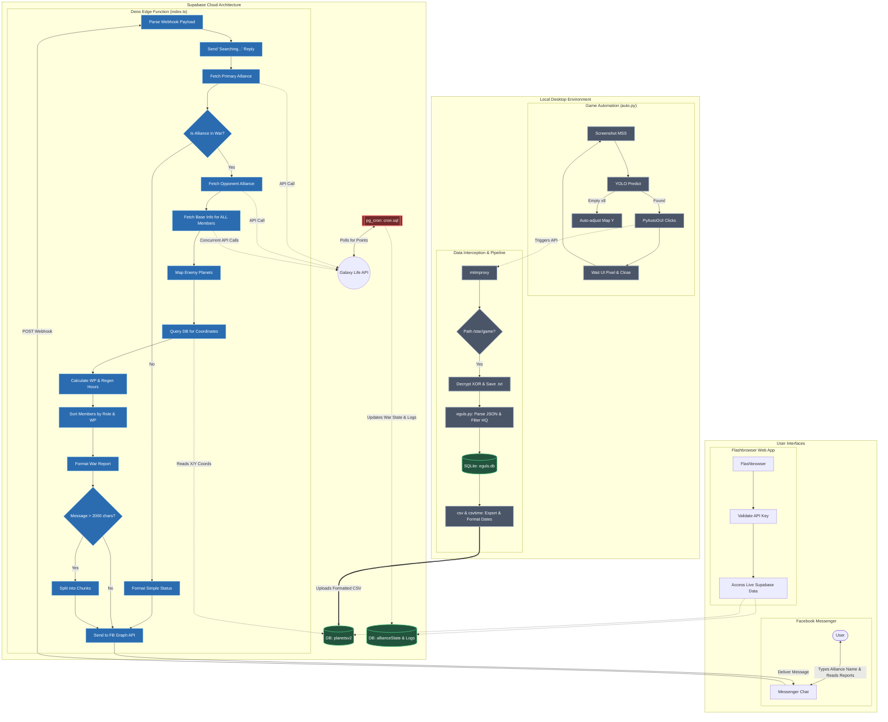

# tagapangalaga-ng-galaktik

## Packet Collections Demo
Youtube: https://youtu.be/7cqsey8IzDU

## Technology Stack

### Programming Language
- **Python v3.13** for overall portability, and AI stuff
- **Typescript** for Supabase functions and Webhook from Facebook
- **HTML / CSS / JS** for the User Interface

### Libraries (Python)
- **Pillow** for image manipulation, mostly for debugging / testing
- **mss** for quick, silent screenshots. It is the *eye* of this script
- **PyAutoGUI** for automatic Inputs. It is the *hands* of this script
- **Keyboard** for listening hotkey inputs, lets say I wanna pause, or resume running script
- **Ultralytics** (YOLO AI) for running AI shenanigans
- **torch** (PyTorch) doing the heavy lifting on training the AI
- **mitmproxy** for packet sniffing

### Database
- **SQLITE** for initial testing and validation of my schema
- **PostgreSQL**, used by *Supabase*, which is my free backend. Also has *cron-jobs*

### Frontend
- **Flashbrowser** (https://github.com/radubirsan/FlashBrowser) free open source Flashbrowser that i forked, so that I can integrate my bot
- **Facebook Business Page** via webhook, for automatic messenger bot directly on *messenger*
- **bot.html** standalone UI file to check details even without Flashbrowser (since this file is just integrated on Flashbrowser anyways)

### Backend
- **Supabase**, a very generous free SQL backend with free Disk and CPU compute

## YOLO AI Files here:
GDRIVE Link: https://drive.google.com/drive/folders/1akZ7zv4Uz__sUlJ_11Prw9YaaMR09WU7?usp=sharing

Path for **best.pt** (AI predicting model):
- \YOLO AI\runs\detect\train\weights\best.pt

Path for training images:
- \YOLO AI\Label Studio\images\train

## Kind of core logic?

